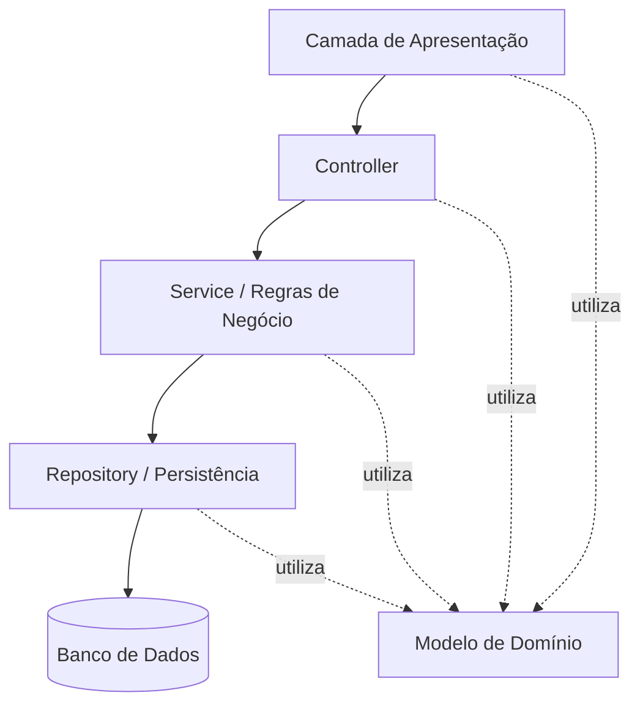

# Diagrama de Arquitetura

As setas contínuas mostram o encaminhamento de uma solicitação: a apresentação interage com o usuário, o controller recebe a ação, o service coordena as regras e o repository realiza o acesso à persistência. Os resultados retornam às camadas anteriores.

As setas pontilhadas indicam uso do modelo de domínio conforme a responsabilidade de cada camada. O modelo reúne Usuario (classe abstrata), Cliente, Profissional, Administrador, Servico, Disponibilidade, Agendamento e o enum StatusAgendamento. Ele não é uma etapa linear depois do banco.

Este diagrama representa a arquitetura prevista. Interface, banco de dados e frameworks permanecem a definir. Consulte [arquitetura](../docs/arquitetura.md) e [diagrama de classes](diagrama-classes.md).
