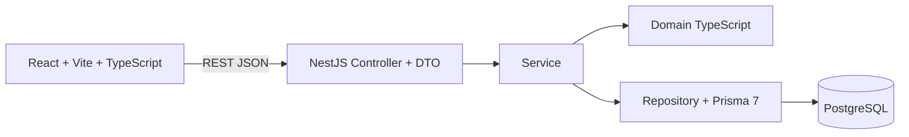

# Arquitetura

```mermaid
flowchart LR
 W[React + Vite + TypeScript] -->|REST JSON| C[NestJS Controller + DTO]
 C --> S[Service]
 S --> D[Domain TypeScript]
 S --> R[Repository + Prisma 7]
 R --> P[(PostgreSQL)]
```

Tailwind CSS, Router, Query e RHF + Zod compõem a interface. PostgreSQL pode ser local ou Supabase. Veja [arquitetura](../docs/arquitetura.md).
