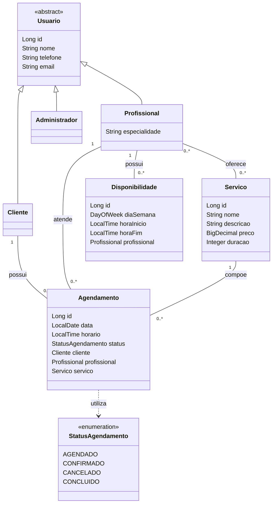

# Diagrama de Classes

Modelo conceitual da primeira entrega de **30/09/2026**. As classes e o enum ainda não foram implementados.

Usuario é uma **classe abstrata**; Cliente, Profissional e Administrador herdam seus atributos sem repeti-los. `0..*` equivale a `0..N` na documentação textual. As referências exibidas nos atributos de Agendamento e Disponibilidade são as mesmas associações representadas pelas linhas, não relações adicionais.

`duracao` representa minutos. StatusAgendamento será um enum Java. A linha pontilhada indica uso desse tipo, sem uma associação entre entidades. A visibilidade dos atributos e os métodos serão detalhados na implementação, respeitando o encapsulamento.

Consulte [entidades](../docs/entidades.md), [dados](../docs/dados.md), [relações](../docs/relacoes.md) e [requisitos](../docs/requisitos.md).
