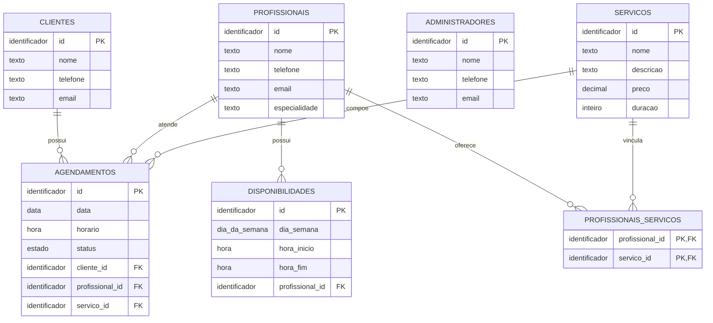

# Diagrama Entidade-Relacionamento

Modelo conceitual dos dados que serão armazenados em MySQL. Os tipos abaixo são descritivos; o esquema físico e os scripts SQL serão elaborados na implementação.

`||` indica exatamente um e `o{` indica zero ou muitos. Cada agendamento referencia exatamente um cliente, profissional e serviço. Cada disponibilidade pertence a exatamente um profissional.

A relação N:N entre profissionais e serviços é resolvida por PROFISSIONAIS_SERVICOS. Cada linha da associação tem duas chaves estrangeiras, que juntas formam a chave primária composta sugerida. O par profissional/serviço do agendamento deve existir nessa associação (RN03); as linhas do diagrama, isoladamente, não expressam essa validação.

ADMINISTRADORES aparece sem associação própria porque não foi definida uma relação persistente específica para esse perfil. Gerenciar informações é uma responsabilidade, não uma chave estrangeira adicional.

Usuario é uma classe abstrata do modelo de objetos. A estratégia de persistência da herança permanece a definir; apresentar os dados comuns nas tabelas conceituais não fixa uma estratégia nem exige uma tabela `usuarios`.

`duracao` representa minutos, e `status` corresponde a `AGENDADO`, `CONFIRMADO`, `CANCELADO` ou `CONCLUIDO`. Consulte [modelo de dados](../database/modelo-dados.md), [relações](../docs/relacoes.md) e [requisitos](../docs/requisitos.md).
